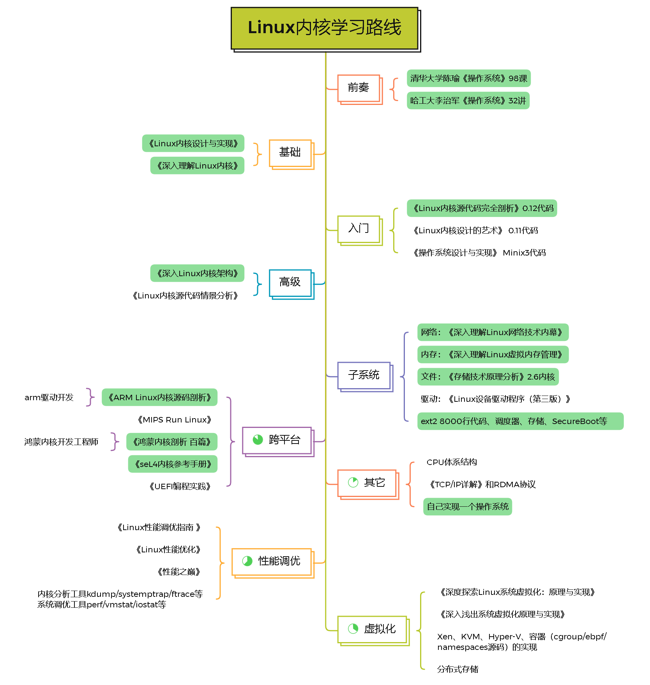

# ·天书夜读·专栏

这个专栏主要用于记录自己平时的读书笔记和思维碎片。

Study notes can persist for three years, you will be able to become a teacher.

## 思维碎片

[Piece of Mind.](./piece_of_mind.md)

## 我的书单

[Book List](./books_list.md)

## 阅读计划

- 第1期：Linux内核学习路线（上）
  - Linux内核设计与实现
  - 深入理解Linux内核
  - Linux内核源代码完全剖析
  - 深入Linux内核架构
- 第2期：Linux内核学习路线（下）
  - 深入理解Linux虚拟内存管理
  - 深入理解Linux网络技术内幕
  - 存储技术原理分析
  - Linux设备驱动程序（第三版）
  - 鸿蒙内核剖析百篇
  - 深入浅出系统虚拟化原理与实现
- 第x期：零散阅读计划
  - 暂无

### 第1-2期：Linux内核学习路线

共分两期，2022年至2023年两年的学习计划，目标是符合Linux内核高级工程师的工作要求。

#### 第1期

2023年春节前完成前奏、基础、入门和高级内容的学习，包括四本书和两套课，通读Linux 0.12内核代码，使自己对内核框架能有清晰的认识。

年底任务：

- 编写一款精简的64位操作系统RainOS。以0.12内核代码为基础并集成2.6等版本的优秀特性，尽可能简化内核模块，删除不需要的低版本陈旧功能，保留最优化的功能代码，实现最基本的shell交互，最终在x86开发板上运行起来。
- 完成《八小时从零默写一个操作系统》冰桶挑战。

#### 第2期

2023年底前完成子系统（内存、文件、网络、IO、安全子系统）、跨平台（主要是鸿蒙内核）和虚拟化（kvm和docker）的学习，包括各个子系统的书籍和源码实现、通读鸿蒙内核代码、通读kvm和docker源代码三部分内容。

年底任务：

- 华为云计算HCIE和鸿蒙内核工程师考证。
- 自己动手写虚拟机—精简的kvm。

#### 第x期：零散阅读计划

暂无。

---

:copyright: 2021-2022 :rocket: `DR0p1ET`.
