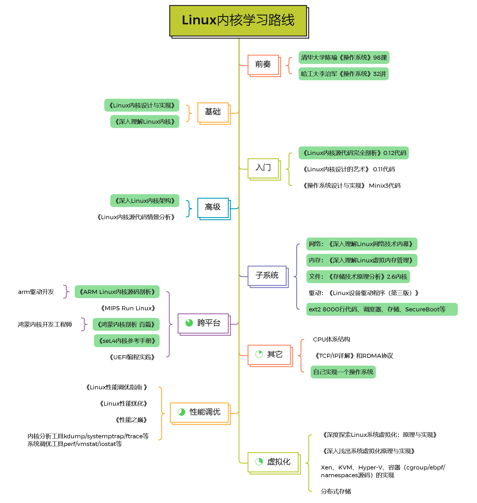

# 专业书单

下面是笔者自己的网络安全领域书单，偏重于二进制。

- 操作系统
  - 体系架构
    - Intel® 64 and IA-32 Architectures Software Developer's Manual
    - AMD64 Architecture Programmer's Manual
    - x86/x64体系探索及编程
    - 处理器虚拟化技术
  - Linux
    - Linux内核设计与实现
    - Linux内核源代码完全剖析 0.12代码
    - 深入理解Linux内核
    - 深入Linux内核架构
    - Linux内核源代码情景分析
  - Windows
    - Windows内核原理与实现
    - Windows内核情景分析
    - Inside Windows2000
    - Microsoft Windows Internals
    - Undocumented Windows NT
  - 其它
    - 清华大学陈瑜《操作系统》98课/哈工大李治军《操作系统》32讲
    - 操作系统设计与实现 Minix3
    - 鸿蒙内核剖析百篇
    - seL4内核参考手册
  - OS编写
    - 一个64位操作系统的设计与实现
- 漏洞利用
  - 0day安全：软件漏洞分析技术（第2版）
  - 漏洞战争：软件漏洞分析精要
  - 揭秘家用路由器0day漏洞挖掘技术
  - 云虚拟化安全攻防实战
- 逆向工程
  - 加密与解密（第4版）
  - C++反汇编与逆向分析技术揭秘（第2版）
- 软件调试
  - 软件调试
  - 格蠹汇编
  - 捉虫日记
  - Windows高级调试
- 编程语言
  - 汇编语言（第3版）
  - 汇编语言：基于x86处理器（原书第7版）
- 算法
  - 算法导论（第三版）
  - MIT公开课：算法导论

附录：

0x01 Linux学习路线图

### 第1-2期：Linux内核学习路线

共分两期，2022年至2023年两年的学习计划，目标是达到Linux内核高级工程师的工作要求。

#### 第1期

2022年底完成前奏、基础、入门和高级内容的学习，包括五本书和两套课，通读Linux 0.12内核代码，使自己对内核框架能有清晰的认识。

年底任务：

- 编写一款精简的64位操作系统RainOS。以Linux 0.12和Minix3内核代码为基础，集成Linux 2.6高版本优秀特性，尽可能简化内核模块，删除不需要的低版本陈旧功能，保留最优化的功能代码，包括进程、内存、IO、文件、网络五个部分，实现最基本的shell交互，最终在x86开发板上运行起来。
- 完成《八小时从零默写一个操作系统》冰桶挑战。

#### 第2期

2023年底完成主要子系统（进程、内存、IO、文件、网络、安全子系统）、微内核（主要是鸿蒙和seL4）和虚拟化（kvm和docker三大件）的学习，包括各个子系统的书籍和源码实现、通读鸿蒙和seL4内核源代码、通读kvm和docker源代码等内容。

年底任务：

- 华为云计算HCIE和鸿蒙内核工程师考证。
- 自己动手写虚拟机—精简的kvm。
- 内核提权和虚拟机逃逸的Fuzzing工具。

### 第3期：Intel/AMD开发手册导读

长期计划，完成Intel和AMD开发手册的阅读。

- Intel® 64 and IA-32 Architectures Software Developer's Manual Volume 1-3
- AMD64 Architecture Programmer's Manual Volume 1-5

参考国内出版的《x86/x64体系探索及编程》和《处理器虚拟化技术》两本书。

任务：

- 中文版导读手册。

以导读翻译的形式出一本导读手册，以雅的翻译手法从整体上把握开发手册的核心要义。

### 第4期：算法导论

2022年底完成完成《算法导论》以及《麻省理工公开课：算法导论》的学习，长期计划是坚持做LeetCode网站上的算法题，争取一周完成3-5道算法题。

任务：

- LeetCode刷题。

刻意练习。

### 第x期：零散阅读计划

暂无。

未完待续。
